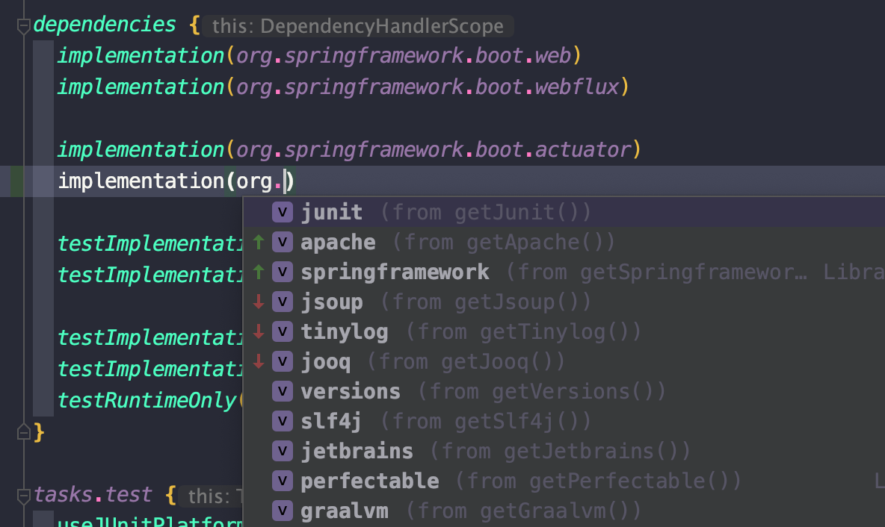

# Shared Gradle Catalogs

Gradle Version Catalogs, but reusable.



## Installation

The catalogs are implemented as a (Settings) plugin for Gradle (7.4+).
Currently it’s not available in the plugin repository. The recommended way to install the catalogs for now is using a Gradle [Included Build](https://docs.gradle.org/current/userguide/composite_builds.html):

1. Add this repo to your project via git submodule or [git-subrepo](https://github.com/ingydotnet/git-subrepo#name) (recommended)
2. Include it as composite build and apply the plugin. In your `settings.gradle(.kts)`, add the following:
```gradle
pluginManagement {
  includeBuild("libs/catalogs") // Path to the catalogs directory
}

plugins {
  id("me.foreverigor.gradle.catalogue")
}
```
3. After a re-sync the dependencies should be now available in your build scripts

The full list of dependencies and their coordinates can be seen in [Catalogs.kt](src/main/java/me/foreverigor/gradle/catalogs/Catalogs.kt)

## Usage

See Gradle guide [Using a version catalog](https://docs.gradle.org/current/userguide/platforms.html#sub:version-catalog)

### Specify Versions
After following the instructions above there are several ways to change the versions of the dependencies from the catalog.

 You can specify the gradle version constraint directly:
```gradle
dependencies {
  implementation(org.slf4j.api) {
    version { require("latest.release") }
  }
}
```

Or use custom version configuration through the plugin’s extension. In your `settings.gradle(.kts)` create a new versions object and tell the plugin to use it:
```gradle
object MyVersions : CatalogVersions(
  Slf4j = "1.7",
  Picocli = latestRelease // Change values in constructor
) {
  // Or override the properties (start writing to get IDE suggestions)
  override var SpringBoot = withoutVersion
}

// let the plugin use your versions
gradleCatalogue {
  versions = MyVersions // Not recommended to create instance here, better use a top-level val/ singleton
}
```

A complete usage example is available in [consumer](examples/consumer).
Note: all examples use Kotlin DSL, which is recommended.

## See Also

- Gradle `version-catalog` plugin [link](https://docs.gradle.org/current/userguide/platforms.html#sub:version-catalog)
- [refreshVersions](https://github.com/Splitties/refreshVersions) – similar plugin with a list of dependencies, created before Gradle version catalogs were a thing

## Roadmap

- [ ] Make it possible to specify custom catalog prefix
- [ ] API for configuring catalogs/ merging with existing ones
 
## License

[EPL-2.0](https://www.eclipse.org/legal/epl-2.0/)
